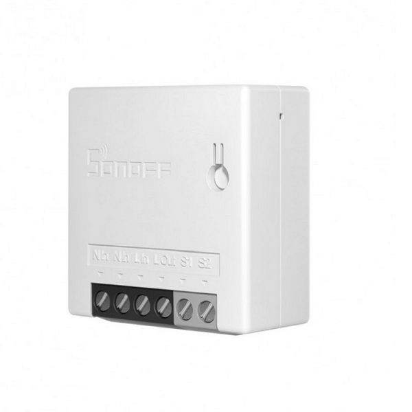
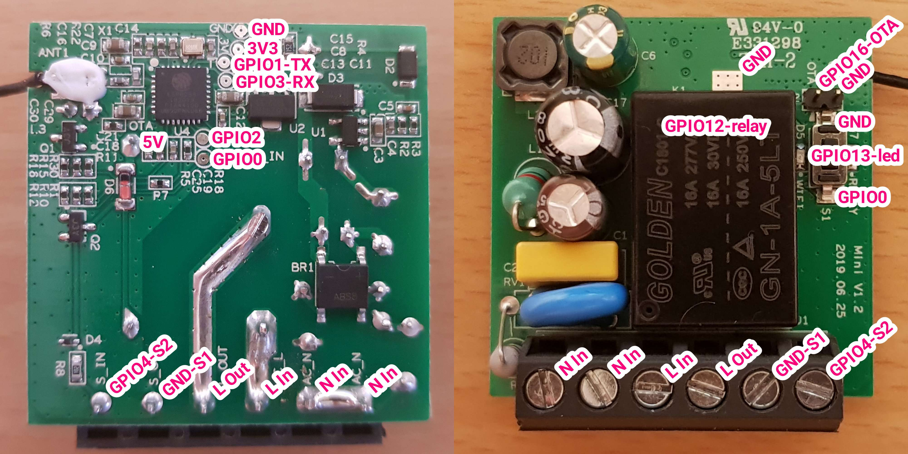

# Sonoff Mini switch with MQTT and Thingsboard
Sonoff Mini Switch Arduino source code over MQTT using [ThingsBoard](https://thingsboard.io/) (Has implemented by reverse engineering the switch functionality)

## Contents
1. Sonoff Mini
2. Flashing
3. Requirements

#### Sonoff Mini
The Sonoff Mini is, as the name implies, a very small device, designed to be hidden where there's only supposed to be cables. Since it's not supposed to be visible, it's also designed to easily attach an external button.

#### Flashing
Several free GPIO are available. The OTA jumper pin is the most accessible and very easy to use on a pin header.

#### Requirements
Open Arduino IDE and go to Sketch -> Include Library -> Manage Libraries. Find and install the following libraries:

1. [PubSubClient 2.6 by Nick O’Leary](http://pubsubclient.knolleary.net/)
2. [ArduinoJson 5.8.0 by Benoit Blanchon](https://github.com/bblanchon/ArduinoJson)

Happy coding!!!
